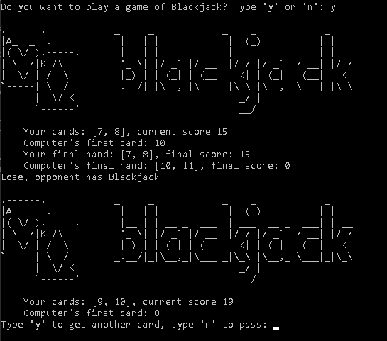

# Blackjack

## Descrição
Esse é o famoso jogo de cartas Blackjack, alguns conhecem ele por "21". O objetivo desse jogo é ter cartas em que a soma dos valores deem o mais proximo possivel de 21
ou que consiga 21. Caso passe de 21 a soma dos valores, você perde! Para ganhar do seu adversario você deve ter o mais proximo de 21 possivel 

## Imagens
### Usando o Caesar-Cipher
<td valign="top">
