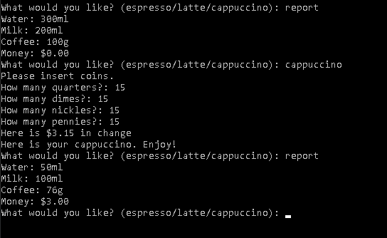

# Coffee Machine

## Descrição
Esse projeto é uma simulação de uma maquina de café basica. Nela você seleciona qual café você quer, dentro das opções (Espresso, Latte ou Cappuccino), coloca a quantidade de moedas desejas e a maquina irá devolver um café. 

Caso digite "report" a maquina irá mostrar a quantidade recursos que ela possui no momento, como quantos litros de agua, quanto de café, quantos litros de leite e quanto de dinheiro ela possui.  
Para desliga-lá apenas digite "off"

## Imagens
### Usando a Coffee Machine
<td valign="top">
