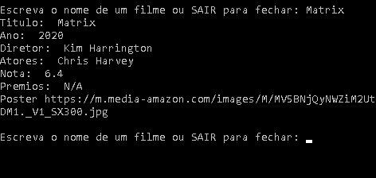
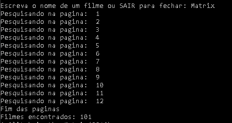
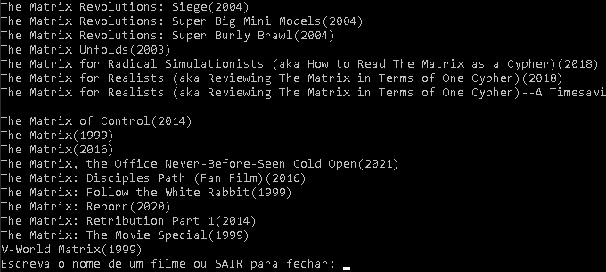

# Consultar Filmes

## Descrição
Script construido utilizando a API omdbAPI, que é uma API livre sobre filmes. O objetivo desse projeto é facilitar a busca por dados de filmes para as pessoas 
Nesse projeto há dois arquivos, o ConsultaFilme.py procura pelo filme especificado, ou caso tenha colocado incompleto ele irá retornar o primeiro filme encontrado 
O segundo arquivo é ConsultaListaFilme.py, nele sua pesquisa retorna a quantidade e o nome de todos os filmes que contem a palavra especificada.

## Imagens
### ConsultaFilme.py
<td valign="top">

### ConsultaListaFilme.py
<td valign="top">
<td valign="top">
