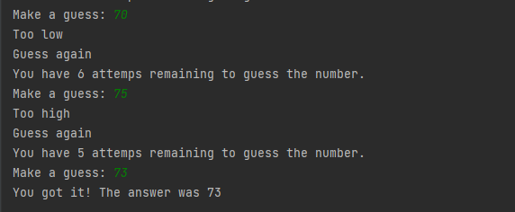

# Guess the Number

## Descrição
Você deve adivinhar qual numero o computador "pensou" 

## Imagens
### Tela inicial com as informações
##### O numero será de 1 a 100, pode selecionar 2 dificuldades (easy e hard). Na easy você tem 10 tentativas, na hard são apenas 5.
<td valign="top">

### Tentativa de responder
##### Caso chute um numero baixo ele ira voltar como "Too low", caso seja alto "Too high" e caso acerte "You got it!"
<td valign="top">
