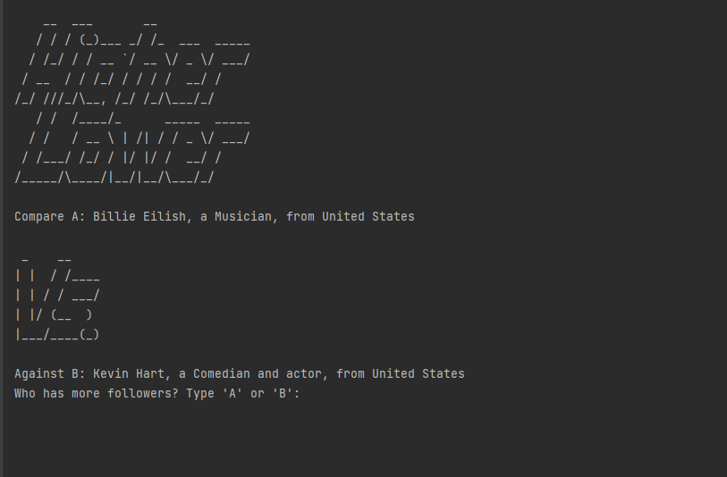
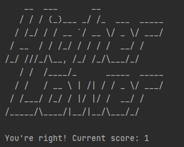

# Higher Lower

## Descrição
É um jogo onde você tem que acertar qual dos dois é "maior" em algo definido no jogo, nesse caso em especifico é de seguidores. Ai entre a opção A e B, deverá 
escolher qual possui mais seguidores no Instagram! Caso acertar soma um ponto, caso errar o jogo encerra e mostra sua pontuação final 

## Imagens
### Tela inicial com as informações
<td valign="top">

### Tentativa de responder
<table>
  <tr>
    <td>Caso acerte a resposta</td>
    <td>Caso erre a resposta</td>
  </tr>
  <tr>
    <td valign="top"></td>
    <td valign="top"></td>
  </tr>
 </table>
