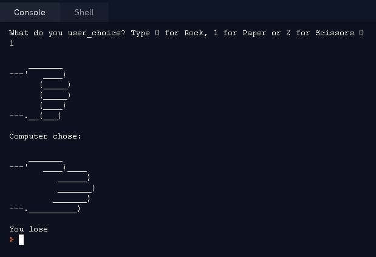
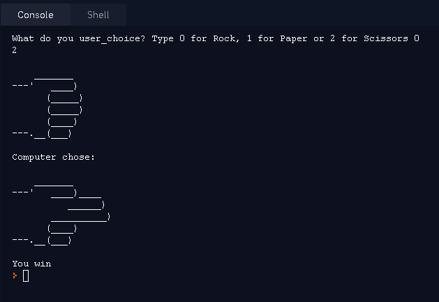
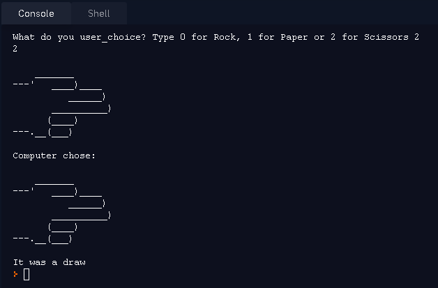

# Rock, Paper or Scissors

## Descrição
Também conhecido como "Jokenpo", nesse jogo é você contra a máquina. Você ira escolher entre pedra, papel ou tesoura, o objetivo é que qual você escolheu ganhe. 

Como ganha? 
Segue a lista de qual vence qual: 
* Pedra > Tesoura 
* Tesoura > Papel 
* Papel > Pedra 

Em caso de escolhas iguais será considera empate

## Imagens
#### Mensagem caso perca o jogo
<td valign="top">

#### Mensagem caso ganhe o jogo
<td valign="top">

#### Mensagem caso empate
<td valign="top">
